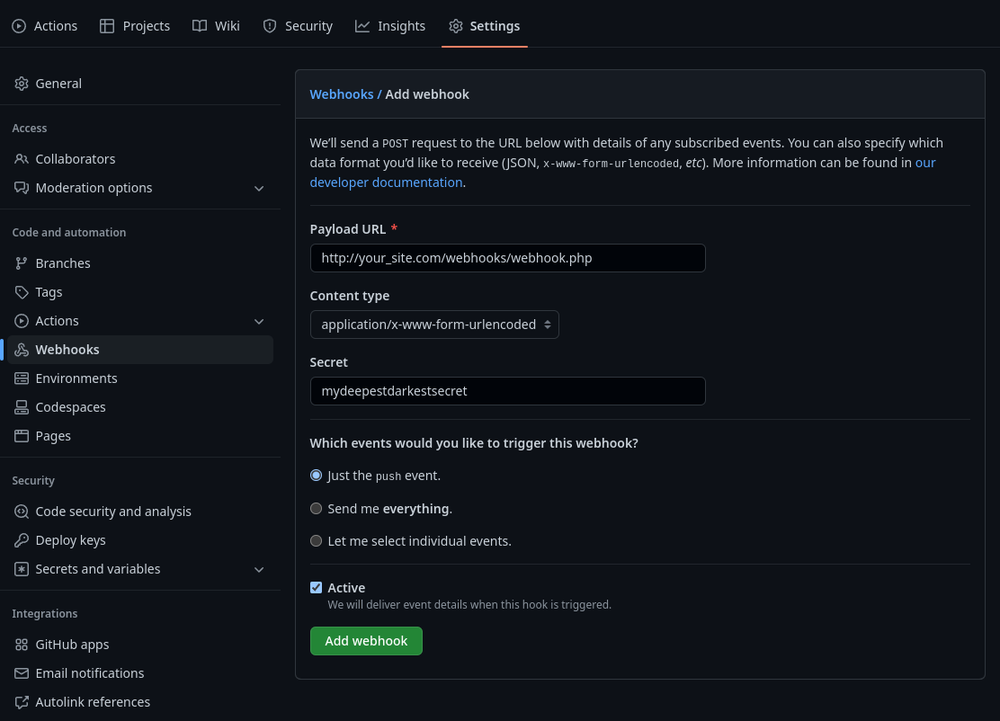

+++
title = "Continuously Deploy your Website using GitHub Webhooks"
description = "Learn how to use GitHub Webhooks to update your website's source files after a repository push."
date = 2023-03-10
+++

## Introduction

In modern day software development continuous integration and deployment are becoming increasingly important for an efficient workflow. In this tutorial you will be learning how to set up continuous deployment to update your website source files after a repository push using webhooks.

Webhooks are callbacks that are triggered by web events. In the case of GitHub, an event can be a repository push, pull, merge, and more. We will create a simple PHP script to respond to a repository push event, which will then pull down website source changes from the repository and organize them neatly in the web root.

---

For this tutorial I will be using bash and Fedora 37. 

Assuming you have already set up your web hosting, navigate to your web root. By default it is stored at `/var/www/html`.

```bash
cd /var/www/html
```

Your project structure should look something like this.

```
/var/www/html
├── index.html
├── style.css
└── anything else
```

Now create a folder to store the webhook, and the webhook itself.

```bash
mkdir webhooks
cd webhooks
touch webhook.php
```

---

## Creating the Webhook

First of all, GitHub uses a shared secret to sign their `POST` requests to your webhook. This verifies that they are genuine and that the message has not been intercepted by a bad actor.

Your secret can be anything you want, I would recommend a large string of random numbers, letters and symbols.

Open up `webhook.php` in your editor of choice and type in the `<?php` opening tag. 

Assign your secret to a variable named `$secret`. In my example I will use "`mydeepestdarkestsecret`". Later on we will share this secret with GitHub, allowing them to sign their `POST` requests.

```php
<?php

$secret = 'mydeepestdarkestsecret';
```

Now extract the GitHub event from the request headers.

```php
$headers = getallheaders();
$event = $headers['X-Github-Event'];
```

Since we only want to execute our script on `push`, we can check for this using a conditional `if` statement.

```php
if ($event == 'push') {
    // update website source
}
```

If we recieve a `push` event then the next step is to compare our hashed payload with GitHub's signature.

First obtain the request payload, then hash it using the `secret`.

```php
$payload = file_get_contents('php://input');
$our_signature = 'sha1=' . hash_hmac('sha1', $payload, $secret);
```

Now we can check if the signatures match, running the website source retrieval script if so.

```php
if ($headers['X-Hub-Signature'] === $our_signature) {
    exec('/path/to/your/script');
}
```

Now add the ending PHP tag to finish the webhook.

```php
?>
```

So far your code should look like this.

```php
<?php

$secret = 'mydeepestdarkestsecret';
$headers = getallheaders();
$event = $headers['X-GitHub-Event'];

if ($event == 'push') {
    $payload = file_get_contents('php://input');
    $our_signature = 'sha1=' . hash_hmac('sha1', $payload, $secret);
    if ($headers['X-Hub-Signature'] === $our_signature) {
        exec('/path/to/your/script');
    }
}

http_response_code(200);

?>
```

---
## Creating the Update Site Source Script

Now let's write the script for updating the website's source.

Start with a shebang and changing directory to your website root.

```bash
#!/bin/bash

cd /var/www/html/
```

Remove all of your current source files **except the webhook folder as well as any other files which are not from your repository**. This will ensure that no files which may have made their way into this folder are served along with your site.

```bash
cp -r webhooks /tmp
# cp (-r) any_other_files_and_directories_you_want_to_keep /tmp
rm -rf *
mv -r /tmp/webhooks .
# mv (-r) /tmp/any_other_files_and_directories_you_want_to_keep .
```

Now with the website root cleaned, clone your repo and `cd` into it.

```bash
git clone https://github.com/your_name/your_repo.git
cd your_repo
```

Copy the new source files into the site root. Yours may be inside a build folder e.g `build`, `public`, `dist`, etc. Then delete the cloned repo.

```bash
mv -f build/* ../
cd ../
rm -rf your_repo
```

Save this script somewhere the web user can access, I'm choosing `/var/www/scripts/get_site_source.sh`. Now make the script executable.

```bash
sudo chmod +x /var/www/scripts/get_site_source.sh
```

The finished script should look like this:
```bash
#!/bin/bash
cd /var/www/html
cp -r webhooks /tmp
rm -r *
mv -r /tmp/webhooks .
git clone https://github.com/your_name/your_repo.git
cd your_repo
mv build/* ../
cd ../
rm -r your_repo
```

Edit `webhook.php` and change the bash script location to where you just saved it.

```php
exec('/path/to/your/script');
```
↓
```php
exec('/var/www/scripts/get_site_source.sh');
```

---

## Repository Settings

The last step is to notify GitHub that you want them to send `POST` requests to your webhook. Open up your repository and go to settings. Navigate to the `Webhooks` tab on the left. Click on `Add webhook` in the top left.

Enter your details like so and click `Add webhook` to save.

<a href=/blog/github-webhooks/github-webhook-example.png></a>

GitHub will now send a test ping to your site to check if it's responsive.

---

## Epilogue

Any subsequent pushes you make to the respository will now execute your webhook, initiating the script and updating your website's source automatically!

If you enjoyed this blog post please consider checking out [some others](/blog)!